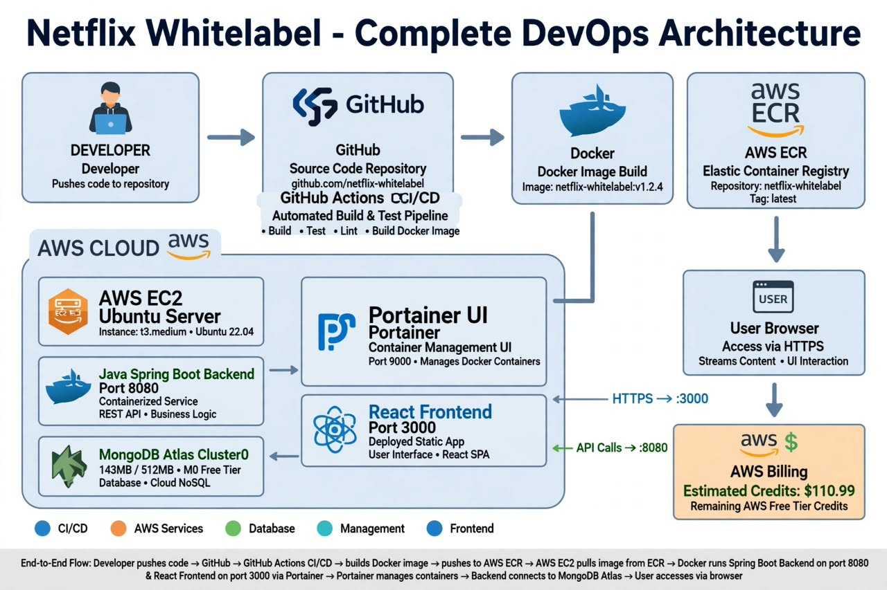

# 🎬 Netflix Whitelabel - Complete DevOps


> Full-stack Netflix clone with white-label support and complete DevOps pipeline. 143MB movies data, Java Spring Boot + React + MongoDB Atlas on AWS.



## 📸 Architecture


**Flow:** `Developer -> GitHub -> GitHub Actions CI/CD -> Docker Build -> AWS ECR -> AWS EC2 (Ubuntu) -> Portainer UI -> Java Backend:8080 + React Frontend:3000 -> MongoDB Atlas Cluster0 -> User Browser`

## 🛠️ Tech Stack

| Layer | Tech | Port / Details |
|-------|------|----------------|
| **Source Control** | GitHub | `netflix-whitelabel` repo |
| **CI/CD** | GitHub Actions | Build, Test, Lint, Docker |
| **Container** | Docker | `netflix-whitelabel:v1.2.4` |
| **Registry** | AWS ECR | Tag: `latest`, 500MB free |
| **Server** | AWS EC2 | Ubuntu 22.04 t3.medium, eu-west-1 |
| **Management** | Portainer | Port 9000 - Docker UI |
| **Backend** | Java Spring Boot | Port 8080 - `/api/movies` |
| **Frontend** | React SPA | Port 3000 |
| **Database** | MongoDB Atlas | Cluster0 - 143MB/512MB M0 Free |

## 🚀 Quick Start

### 1. Database Check (Always ON - Free Tier)
Atlas M0 is always running. No start needed.
```properties
# application.properties
spring.data.mongodb.uri=mongodb+srv://uko:<password>@cluster0.xxxxx.mongodb.net/netflixDB
